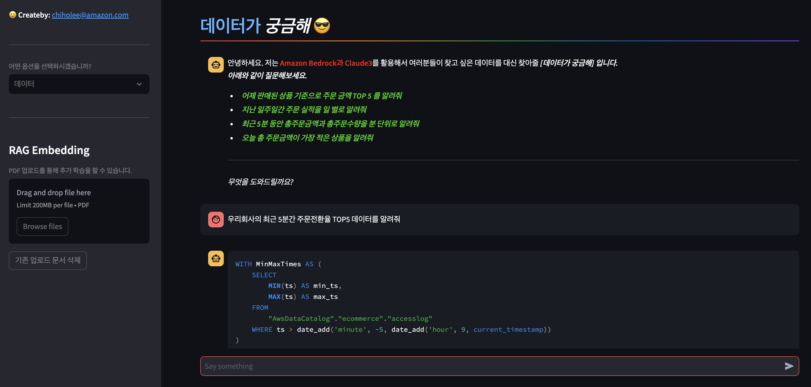
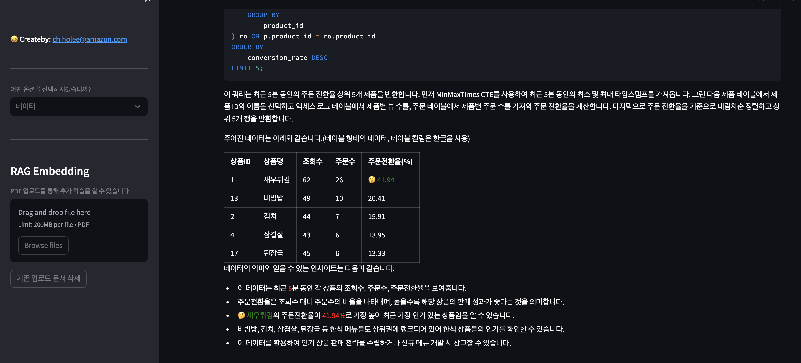

# OpenSearchRAG-LLM-Summit2024

### env
```
cd OpenSearchRAG-LLM-Summit2024
vi .env
OPENSEARCH_USERNAME=
OPENSEARCH_PASSWORD=
OPENSEARCH_ENDPOINT=
OPENSEARCH_INDEX_NAME=
MYSQL_HOST=
MYSQL_PORT=
MYSQL_USER=
MYSQL_PASSWORD=
MYSQL_DB=
```

### Setup
```
cd OpenSearchRAG-LLM-Summit2024
python3.10 -m virtualenv venv
source venv/bin/activate
pip install -r requirements.txt
```


### Capture

